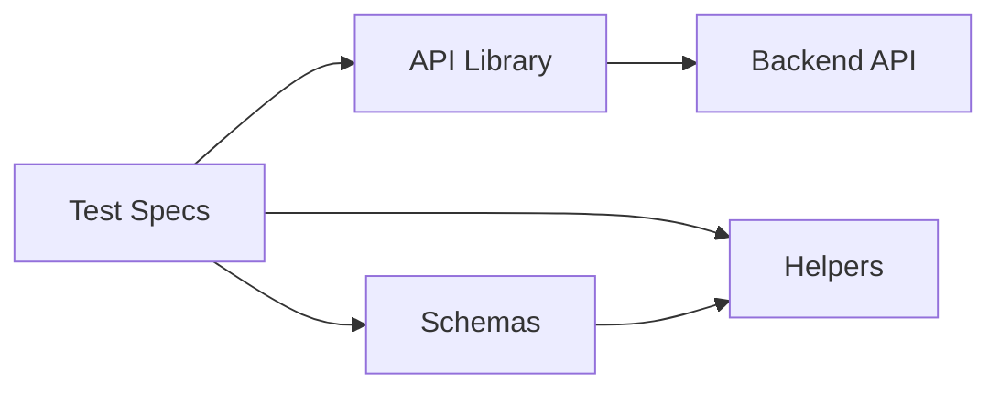
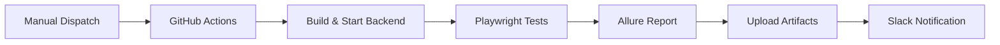

# Racing Platform — API Test Suite

Automated API testing framework for the Racing Platform backend, built with **Playwright** and **Zod** schema validation.

> **37 tests** across 6 suites covering authentication, users, cars, tracks, records, and an end-to-end flow.

---

## Architecture

```
api_library/          → Request functions (one file per resource)
schemas/              → Zod response schemas (success + error + validation)
tests/                → Playwright test specs
helpers/              → Shared utilities (schema assertions, date, random string)
backend/              → Express API server (test target)
```



---

## Test Coverage

| Suite | Positive | Negative | Total |
|-------|----------|----------|-------|
| Authentication | 2 | 4 | 6 |
| Users | 5 | 3 | 8 |
| Cars | 6 | 3 | 9 |
| Tracks | 4 | 2 | 6 |
| Records | 4 | 3 | 7 |
| E2E Flow | 1 | — | 1 |
| **Total** | **22** | **15** | **37** |

Full test case listing: [`tests/test_cases.md`](tests/test_cases.md)

---

## What's Tested

- **Status codes** — correct 200 / 201 / 204 / 400 / 401 / 404 per endpoint
- **Schema validation** — every response validated against Zod schemas
- **CRUD lifecycle** — create, read, update, delete for all resources
- **Input validation** — missing required fields return 400 with details
- **Referential integrity** — records referencing non-existent users/cars/tracks return 404
- **Session management** — login, logout, access denial after logout

---

## Tech Stack

| Tool | Purpose |
|------|---------|
| [Playwright](https://playwright.dev) | API test execution & assertions |
| [Zod](https://zod.dev) | Response schema validation |
| [TypeScript](https://www.typescriptlang.org) | Type-safe test code |
| [Express](https://expressjs.com) | Backend API server |

---

## Getting Started

```bash
# Install dependencies
npm install
cd backend && npm install && cd ..

# Build and start the backend
cd backend && npm run build && npm start &

# Run all tests
npx playwright test

# Run a specific suite
npx playwright test tests/cars.spec.ts

# View HTML report
npx playwright show-report
```

---

## CI/CD Pipeline

The test suite runs in GitHub Actions with Allure reporting and Slack notifications.



| Component | Role |
|-----------|------|
| **GitHub Actions** | Manual trigger via `workflow_dispatch` |
| **Playwright** | Execute the 37 API tests |
| **Allure** | Generate rich test execution report (primary) |
| **Playwright HTML** | Secondary report uploaded as artifact |
| **Slack Webhook** | Post pass/fail summary with link to download report |

### Running the Pipeline

1. Go to **Actions** tab in GitHub
2. Select **API Tests** workflow
3. Click **Run workflow**

### Setup Requirements

Add a GitHub Actions secret named `SLACK_WEBHOOK_URL` with your [Slack Incoming Webhook](https://api.slack.com/messaging/webhooks) URL.

### Local Allure Commands

```bash
# Run tests (generates allure-results/)
npx playwright test

# Generate the HTML report from results
npm run allure:generate

# Open the generated report in browser
npm run allure:open

# One-shot: generate temp report and open it
npm run allure:serve
```

---

## Project Conventions

- Request functions use `requestBody` as the parameter name for POST/PUT payloads
- Tests that create data always clean up after themselves
- Tests with cleanup use **soft assertions** (`expect.soft`) so cleanup runs even on failure
- Test names are prefixed with `[P]` (positive) or `[N]` (negative)
- All dates use the `getCurrentDate()` helper — never hardcoded
